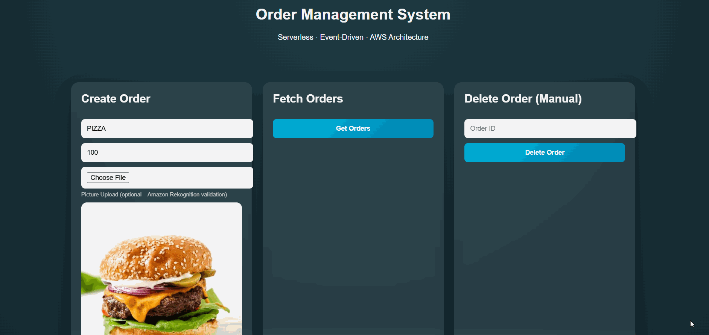
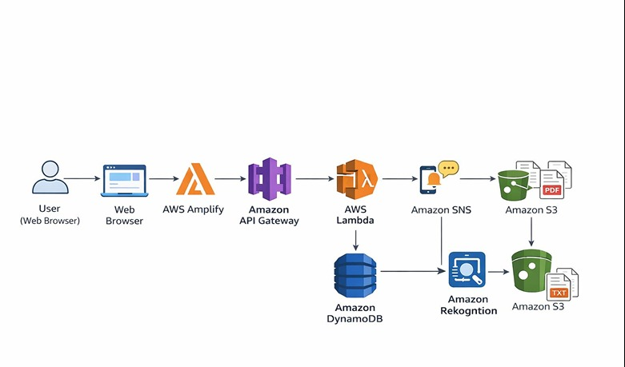
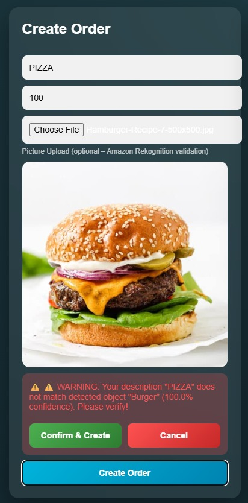

# Event-Driven Serverless Order Management System (AWS)

<p align="center">
  
</p>

---

## Overview

This project implements a fully serverless, event-driven order management system built on AWS.

The system emphasizes architectural separation, asynchronous event processing, and service-level responsibility isolation.

Rather than focusing only on CRUD operations, the design demonstrates distributed flow control, deterministic backend behavior, and cloud-native composition of managed services.

---

## Architecture

<p align="center">
  
</p>

The system is structured across four conceptual layers:

### Entry Layer
- AWS Amplify (Frontend Hosting)
- Amazon API Gateway

### Compute Layer
- Independent AWS Lambda functions
- Each Lambda handles a single responsibility

### Storage Layer
- Amazon DynamoDB (Primary data store)
- Amazon S3 (Archival & reports)

### Event Layer
- Amazon SNS for asynchronous event propagation

Deletion events are published to SNS and processed asynchronously by dedicated handlers.  
This prevents tight coupling between business logic and archival/reporting workflows.

---

## Intelligent Validation (Amazon Rekognition)

During order creation, uploaded images are analyzed using Amazon Rekognition.

If the detected object does not match the user-provided description, the system presents a confidence-based warning before confirmation.

<p align="center">
  
</p>

This demonstrates AI-assisted validation integrated into a serverless execution flow.

---

## Event-Driven Processing Model

Deletion flow:

1. Order deletion request hits API Gateway
2. Lambda removes record from DynamoDB
3. Lambda publishes deletion event to SNS
4. SNS asynchronously triggers:
   - Archival Lambda (stores deleted order in S3)
   - Email notifications

This design ensures:

- Loose coupling
- Asynchronous processing
- Clear service boundaries
- No blocking side-effects inside core logic

---

## PDF Report Generation

Deleted orders stored in S3 can be aggregated into a dynamically generated PDF report.

- Generated via dedicated Lambda
- Reads archival data
- Produces PDF
- Returns secure presigned URL

The reporting system remains isolated from core order logic.

---

## Lambda Structure

```
lambdas/
├── create_order
├── update_order
├── delete_order
├── get_orders
├── get_order_by_id
├── recognize_uploaded_image
├── on_order_deleted
├── archive_deleted_orders
├── generate_pdf_report
├── subscribe_email
└── unsubscribe_email
```

Each Lambda is isolated and deployable independently.

---

## Engineering Principles Demonstrated

- Event-driven architecture
- Asynchronous processing via SNS
- Service responsibility separation
- Cloud-native design
- AI integration within backend validation
- Stateless execution model
- Managed service orchestration
- Presigned URL secure access

---

## Technologies

- AWS Lambda
- Amazon API Gateway
- Amazon DynamoDB
- Amazon SNS
- Amazon S3
- Amazon Rekognition
- AWS Amplify
- Python (boto3)
- ReportLab (PDF generation)

---

## Summary

This project demonstrates how distributed serverless components can be composed into a coherent, loosely coupled backend system.

It highlights event-driven flow control, asynchronous service communication, and cloud-native architectural discipline using managed AWS services.
